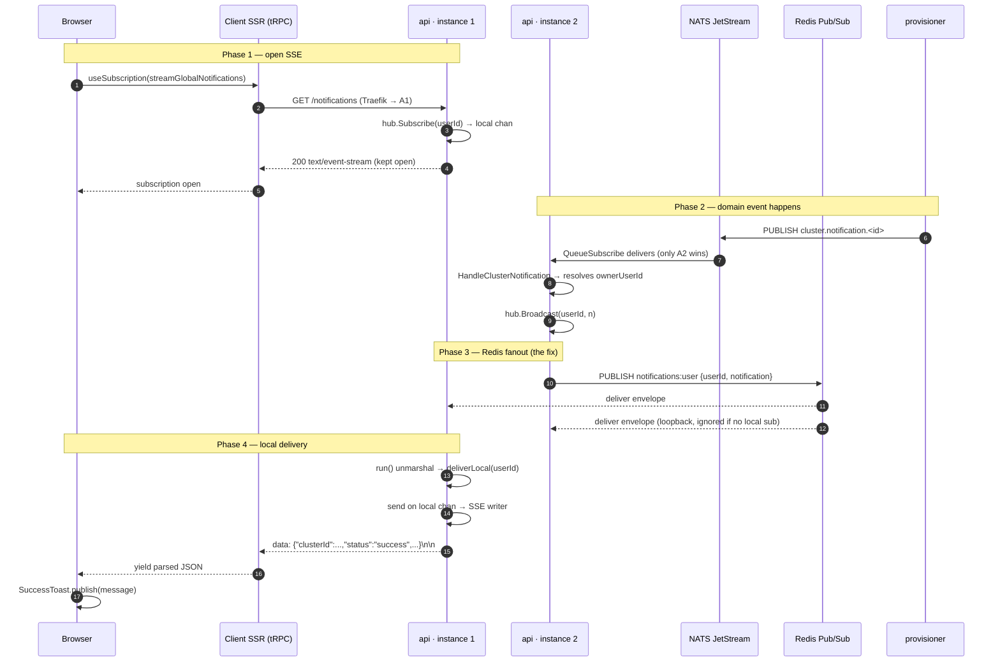
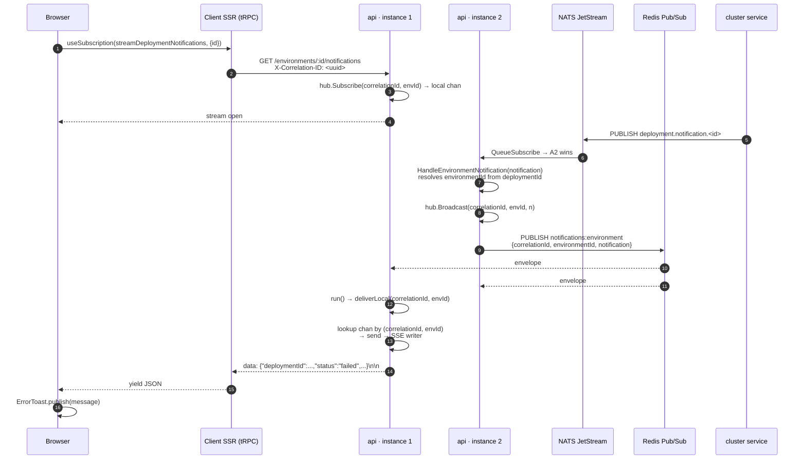

# Notification System Architecture

End-to-end design of the SSE-based notification delivery, made horizontally
scalable with Redis Pub/Sub.

---

## 1. The two notification flows

| Flow | Triggered by | Routing key | SSE endpoint | Redis channel |
|---|---|---|---|---|
| **Environment** (build / deploy toasts) | `builder`, `cluster` | `(correlationId, environmentId)` | `GET /environments/:id/notifications` | `notifications:environment` |
| **User / Global** (cluster lifecycle toasts) | `provisioner`, `cluster` | `userId` (org owner) | `GET /notifications` | `notifications:user` |

---

## 2. High-level component diagram

```
                    ┌────────────────────────────────────────────────────────┐
                    │                    BROWSER (React)                     │
                    │  EnvironmentNotificationListener                       │
                    │  ClusterNotificationListener                           │
                    │     useSubscription → tRPC client → fetch (EventSrc)   │
                    └───────────────────────────┬────────────────────────────┘
                                                │ HTTPS / SSE
                                                ▼
                    ┌────────────────────────────────────────────────────────┐
                    │       CLIENT SSR (React Router · tRPC server)          │
                    │  routers/notifications.streamGlobalNotifications       │
                    │  routers/environment.streamDeploymentNotifications     │
                    │     async generator parses "data: …\n\n" → yields JSON │
                    └───────────────────────────┬────────────────────────────┘
                                                │ HTTP / SSE (basic auth)
                                                │ Traefik load-balanced
            ┌───────────────────────────────────┼───────────────────────────────────┐
            ▼                                   ▼                                   ▼
   ┌─────────────────┐                 ┌─────────────────┐                 ┌─────────────────┐
   │   api inst. 1   │                 │   api inst. 2   │                 │   api inst. N   │
   ├─────────────────┤                 ├─────────────────┤                 ├─────────────────┤
   │ SSE handler     │                 │ SSE handler     │                 │ SSE handler     │
   │   ↕ chan        │                 │   ↕ chan        │                 │   ↕ chan        │
   │ Local Hub map   │                 │ Local Hub map   │                 │ Local Hub map   │
   │   ↕             │                 │   ↕             │                 │   ↕             │
   │ run() goroutine │                 │ run() goroutine │                 │ run() goroutine │
   │   ↕             │                 │   ↕             │                 │   ↕             │
   │ NATS consumer   │                 │ NATS consumer   │                 │ NATS consumer   │
   └────────┬────────┘                 └────────┬────────┘                 └────────┬────────┘
            │ SUBSCRIBE                         │ SUBSCRIBE                         │ SUBSCRIBE
            │ + PUBLISH                         │ + PUBLISH                         │ + PUBLISH
            └───────────────────────────────────┼───────────────────────────────────┘
                                                ▼
                          ┌──────────────────────────────────────┐
                          │           Redis Pub/Sub  ◄── NEW     │
                          │  notifications:environment           │
                          │  notifications:user                  │
                          │  (fanout to ALL subscribers)         │
                          └──────────────────────────────────────┘
                                                ▲
                                                │ one api instance "wins"
                                                │ via NATS queue group, then
                                                │ rebroadcasts to peers via Redis
                          ┌─────────────────────┴────────────────┐
                          │            NATS JetStream            │
                          │  cluster.notification.*              │
                          │  deployment.notification.*           │
                          │  build.notification.*                │
                          │  (QueueSubscribe → load-balanced)    │
                          └─────────────────────┬────────────────┘
                                                ▲ Publish
            ┌───────────────────────────────────┼───────────────────────────────────┐
            │                                   │                                   │
   ┌────────┴─────────┐               ┌─────────┴────────┐                ┌─────────┴────────┐
   │   provisioner    │               │     cluster      │                │     builder      │
   │ PublishCluster   │               │ PublishCluster   │                │ PublishBuild     │
   │ Notification     │               │ Notification     │                │ Notification     │
   │ (lifecycle)      │               │ PublishDeployment│                │ (build done /    │
   │                  │               │ Notification     │                │  failed)         │
   └──────────────────┘               └──────────────────┘                └──────────────────┘
```

---

## 3. Sequence — cluster notification (e.g. cluster deletion)

The user sits on the dashboard with `ClusterNotificationListener` mounted.
NATS queue-loadbalances to a *different* api instance than the one the SSE is on.
Without the Redis layer, the toast would never appear.



---

## 4. Sequence — environment notification (e.g. deployment finished)

Same shape, different routing key. The browser passes an `X-Correlation-ID`
so the api filters the stream for *this* user's action only — multiple users
on the same environment don't see each other's toasts.



---

## 5. Why each piece exists

| Layer | Responsibility | What breaks if removed |
|---|---|---|
| **Browser listener** | Mount once per page where toasts are wanted; map status → toast UI | No toasts |
| **Client SSR (tRPC)** | Adapt SSE byte stream into a tRPC async iterator, keep auth context | Browsers can't easily attach basic-auth headers to `EventSource` |
| **api SSE handler** | Per-connection subscribe/unsubscribe to the local hub, write `data:` frames, flush on each event | No live stream |
| **Local hub map** | O(1) lookup from routing key → connected channels on *this* instance | Can't address a specific browser tab |
| **NATS JetStream** | Durable, retried delivery of domain events from worker services to api; queue group prevents duplicate processing of the same event | Lost notifications on api crash; double-processing |
| **`run()` goroutine + Redis Pub/Sub** | Fans the single received NATS message out to *all* api instances so it reaches whichever instance holds the SSE connection | Notifications missed when worker and SSE hit different api pods (the bug we fixed) |

---

## 6. Why Pub/Sub and not Redis Streams

We already use Redis Streams (`KVStore.AppendToStream`/`ReadStream`) for build
and provisioning **logs**, where replay-on-reconnect matters. Notifications are
different:

- They are **ephemeral toasts** — replaying a 10-minute-old "deploy failed"
  banner when a user reconnects would be confusing.
- We want **fanout to every instance**, not consumer-group balancing.
- "At most once" is fine: if Redis or the SSE drops, the next domain event
  produces a fresh toast.
- One persistent connection per api instance per channel — O(N) connections
  total, not O(N × users).

If durable, replayable notifications are ever needed (an inbox/history page),
add `KVStore.AppendToStream` *alongside* the Pub/Sub publish — they don't
conflict.

---

## 7. Files involved

```
server/
├── cmd/api/main.go                                          fx graph (added redis.Module)
├── internal/
│   ├── api/
│   │   ├── conf/{config.go,module.go}                       Redis config (added)
│   │   ├── application/
│   │   │   ├── cluster.go        HandleClusterNotification          → hub.Broadcast
│   │   │   └── environment.go    HandleEnvironmentNotification      → hub.Broadcast
│   │   ├── infrastructure/nats/impl/queue/queue.go          NATS QueueSubscribe
│   │   └── presentation/
│   │       ├── http/handler/{notifications.go,environment.go}   SSE endpoints
│   │       ├── http/sse/
│   │       │   ├── environment_notification_hub.go ★         Redis-backed fanout
│   │       │   ├── user_notification_hub.go        ★         Redis-backed fanout
│   │       │   └── writer.go                                 SSE frame writer
│   │       └── queue/cluster/consumer.go                     wires NATS → application
│   └── core/
│       ├── domain/port/pubsub.go                ★ NEW        PubSub / Subscription
│       └── infrastructure/redis/
│           ├── pubsub.go                        ★ NEW        Redis impl
│           └── module.go                                     fx providers
└── compose.yml                                              REDIS_* env vars on server-api

client/
├── app/components/organisms/notifications/
│   ├── ClusterNotificationListener.tsx                      mounted in dashboard layout
│   └── EnvironmentNotificationListener.tsx                  mounted per-environment
├── app/server/routers/
│   ├── notifications.ts          streamGlobalNotifications  SSE → tRPC iterator
│   └── environment.ts            streamDeploymentNotifications
└── compose.yml entry already had REDIS_* (used elsewhere)
```

★ = new or substantially changed by the horizontal-scaling refactor.

